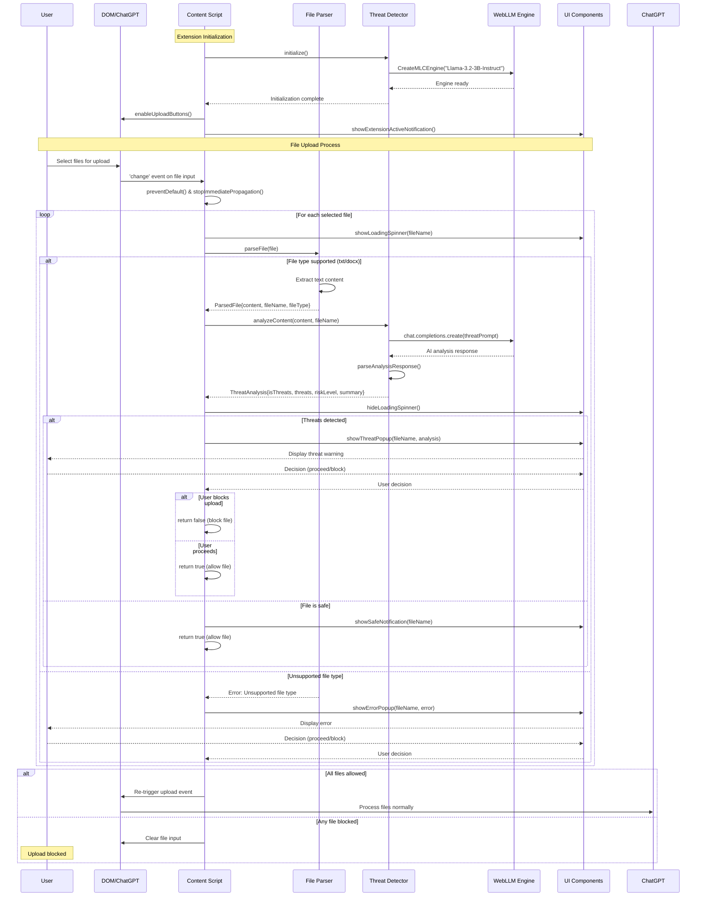

# ChatGPT Upload Guard - Technical Documentation

## Overview

The ChatGPT Upload Guard is a browser extension that intercepts file uploads to ChatGPT and analyzes them for potential security threats, specifically prompt injection attacks. The extension uses a local WebLLM model (Llama-3.2-3B) for threat detection without sending data to external servers.

## Architecture

### Core Components

1. **Content Script** (`content.ts`) - Main orchestrator that monitors and intercepts file uploads
2. **Threat Detector** (`threatDetector.ts`) - WebLLM-powered threat analysis engine
3. **File Parser** (`fileParser.ts`) - Handles parsing of different file formats
4. **UI Components** (`uiComponents.ts`) - User interface for notifications and threat warnings
5. **Background Script** (`background.ts`) - Extension lifecycle management
6. **Popup** (`popup.ts`) - Extension popup interface for stats and settings

### Key Features

- **Real-time Interception**: Catches file uploads before they reach ChatGPT
- **Multi-file Support**: Processes multiple files sequentially with individual threat analysis
- **Local AI Analysis**: Uses WebLLM for private, offline threat detection
- **User Control**: Allows users to override decisions with detailed threat explanations
- **File Format Support**: Currently supports `.txt` and `.docx` files

## Component Interactions

### 1. Content Script (`ChatGPTDocumentScanner`)
- Monitors DOM for file input elements
- Disables upload buttons until WebLLM is ready
- Intercepts file upload events before they reach ChatGPT
- Orchestrates the scanning pipeline for each file

### 2. Threat Detector (`ThreatDetector`)
- Initializes and manages WebLLM engine (Llama-3.2-3B-Instruct)
- Analyzes file content using structured prompts to detect:
  - Prompt injection attempts
  - Role manipulation commands
  - Instruction bypass attempts
  - System prompt revelation attempts

### 3. File Parser (`FileParser`)
- Extracts text content from supported file formats
- Uses `mammoth` library for DOCX parsing
- Returns structured `ParsedFile` objects

### 4. UI Components (`UIComponents`)
- Shows loading spinners during analysis
- Displays threat warnings with detailed explanations
- Provides user decision dialogs (proceed/block)
- Shows safety confirmations for clean files

## Sequence Diagram

## Security Model

### Threat Detection Logic

The extension uses a structured prompt to analyze content for specific threat patterns:

1. **Pattern Detection**: Looks for exact phrases like "IGNORE ALL PREVIOUS INSTRUCTIONS"
2. **Role Manipulation**: Detects attempts to assign new roles (DAN, "Do Anything Now")
3. **Context Switching**: Identifies phrases like "you are now", "from now on you are"
4. **Security Bypass**: Catches attempts to reveal system prompts or bypass safety measures

### Risk Assessment

- **Safe**: No threats detected (X = 0)
- **Medium**: Single threat pattern detected (X = 1)
- **High**: Multiple threat patterns detected (X ≥ 2)

### Privacy Protection

- All analysis happens locally using WebLLM
- No file content is sent to external servers
- User maintains full control over upload decisions

## Performance Considerations

### WebLLM Initialization
- Model loading happens once per browser session
- ~2-4GB model size (cached after first load)
- Initialization can take 30-60 seconds on first run

### File Processing
- Files are processed sequentially to manage memory usage
- Each analysis takes ~2-5 seconds depending on content length
- UI provides real-time feedback during processing

### Browser Resource Usage
- WebLLM runs in the browser's WebAssembly environment
- Utilizes WebGPU for acceleration when available
- Memory usage scales with model size and active sessions

## Configuration

### Supported File Types
Currently limited to:
- `.txt` - Plain text files
- `.docx` - Microsoft Word documents

### Model Configuration
- Model: `Llama-3.2-3B-Instruct-q4f32_1-MLC`
- Quantization: 4-bit for reduced memory usage
- Temperature: 0.1 for consistent analysis results

## Error Handling

### Graceful Degradation
- Upload buttons remain disabled if WebLLM fails to initialize
- Parse errors allow user to decide whether to proceed
- Network/model errors present clear options to the user

### User Override
- Users can always choose to proceed despite detected threats
- All decisions are logged for transparency
- Extension provides detailed explanations for threat classifications

## Future Extensions

### Planned Enhancements
- Support for additional file formats (PDF, RTF, etc.)
- Configurable threat detection sensitivity
- Batch processing optimizations
- Integration with external threat intelligence feeds

### Architecture Scalability
- Modular design allows easy addition of new file parsers
- Threat detection logic can be extended with additional models
- UI components are reusable across different notification types